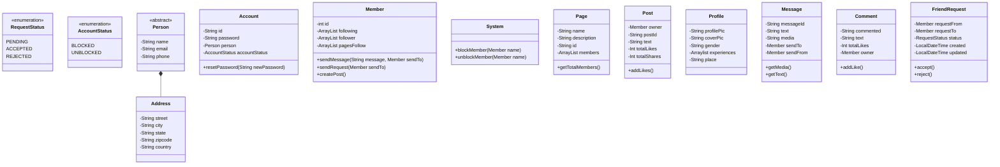

## Facebook Low Level Design

```mermaid
  classDiagram
    class RequestStatus {
        <<enumeration>>
        PENDING
        ACCEPTED
        REJECTED
    }

    class AccountStatus {
      <<enumeration>>
      BLOCKED
      UNBLOCKED
    }

    class Address {
      -String street
      -String city
      -String state
      -String zipcode
      -String country
    }

    class Person {
      <<abstract>>
      -String name
      -String email
      -String phone
    }

    Person *-- Address
    class Account {
      -String id
      -String password
      -Person person
      -AccountStatus accountStatus
      +resetPassword(String newPassword)
    }

    class Member{
      -int id
      -ArrayList<member> following
      -ArrayList<member> follower
      -ArrayList<page> pagesFollow
      +sendMessage(String message, Member sendTo)
      +sendRequest(Member sendTo)
      +createPost()
    }

    class System {
      +blockMember(Member name)
      +unblockMember(Member name)
    }

    class Page {
      -String name
      -String description
      -String id
      -ArrayList<Member> members
      +getTotalMembers()
    }

    class Post {
      -Member owner
      -String postId
      -String text
      -Int totalLikes
      -Int totalShares
      +addLikes()
    }

    class Profile {
      -String profilePic
      -String coverPic
      -String gender
      -Arraylist<String> experiences
      -String place
    }

    class Message {
      -String messageId
      -String text
      -String media
      -Member sendTo
      -Member sendFrom
      +getMedia()
      +getText()
    }

    class Comment {
      -String commented
      -String text
      -Int totalLikes
      -Member owner
      +addLike()
    }

    class FriendRequest {
      -Member requestFrom
      -Member requestTo
      -RequestStatus status
      -LocalDateTime created
      -LocalDateTime updated
      +accept()
      +reject()
    }

```
