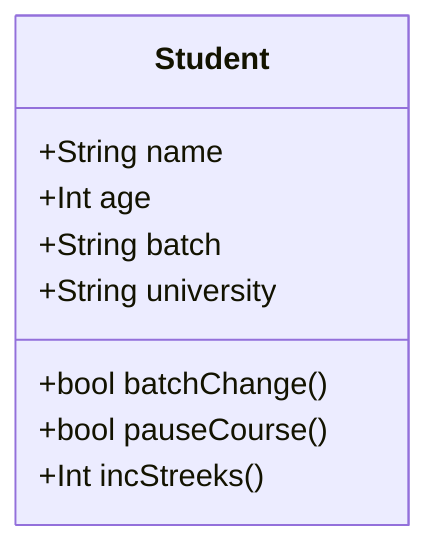
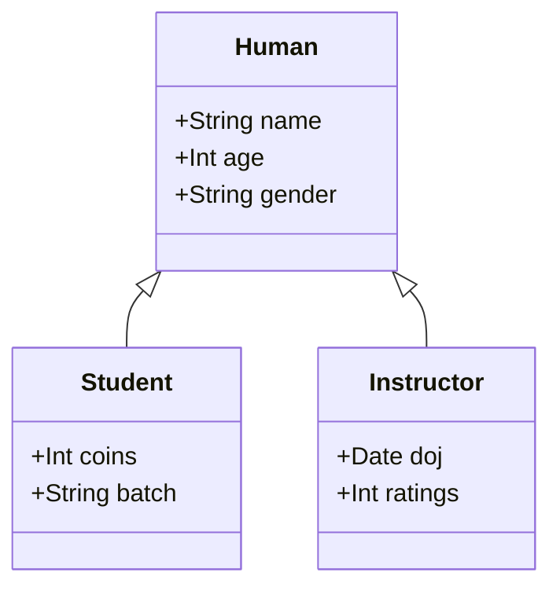
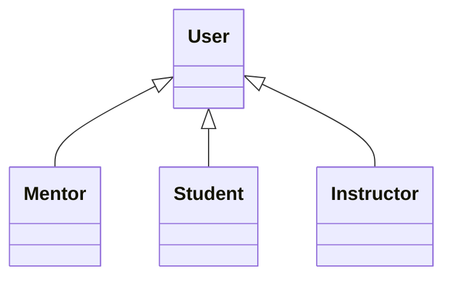

#### What is  LLD?

1. Low level implementation details of a software system.
2. Organization of code.

#### Why is LLD Important?

Phonepe uses yes bank for all its UPI payments and when RBI banned yes bank then it makes only one day to phonepe to be back online all because of good code design and their code are not tightly coupled.

#### Principles of good software

1. Code Reuse.
2. Why it is difficult to write code that is reusable?
    a. Tight Cpupling
        ```Java
            pay(user) {
                rozerpay(user)
            }

            pay(user) {
                payu(user)
            }
        ```
    b. Hardcoded Things
        ```Java
            throw exception() {
                print("Exception occured"); # not resuable
            }
        ```

        ```Java
            throw exception(message) {
                print(message);
            }
        ```

        ```Java
            const PI = 3.14
            findAreOfCircle(redius) {
                return PI * (redius) ^ 2;
            }

            findCircumferenceOfCircle(redius) {
                return PI *2*radius
            }
        ```
3. Extensibility
    a. new requirement
    b. new feature

    example today we support Rozerpay and PayU and tomorrow we want to support paytm. Then how easy is to extend to the new payment provider will be benchmark for extensibility.

    Reasons
        a. New Platform: IOs/Web/Android
        b. Change of user preferences
        c. Product roadmap changes.

Design Patterns/Principles: Tried and tested solution to common desing problem.
    a. this will help to communicate with follow engineers
    b. Identify problems and resolve early.

#### Introduction To OOPS:

1. Sequental/Procedural Programming language:
    ```c++
        int main() {
            int a = 10; // sequential: run line by line
            print(a); // Procedural: execute multiple procedure or function.
        }
    ```

Write a code to store and print the details of an animal.
    animal -> name, id, sound.

class: Blueprint of a real world entity
    ```Java
        class Student {
            name
            age
            batch
            experience
            university
        }

        class Instructors {
            name
            age
            experience
        }

        class Mentor {
            name
        }
    ```

Object: Objects are real instance of a class.

Fields + Methods = Member of a class




State: The value of every field of a class at a particular time is known as the state of the class.


All the child class inherits the attributes and methods from their parent class.

```Java
    public class Human {
        String name;
        String dob;
        String gender;
    }

    public class Student extends Human {
        int id;
        int coin;

        Student() {
            this.name = "";
            dob = "24101998";
            id = 21;
        }

        void updateName(String newName) {
            this.name = newName;
        }
    }
```

Interface: Blueprint of a behaviour. (Contract/API)
It means that anyone who implemented my behaviour should implement the methods that i am telling to implement.

```Java
    interface Run {
        void run();
        void move();
    }

    public interface BatchChange {
        void changeBatch(String newBatch) {

        }
    }

    public class Student extends Human implements BatchChange {
        public void changeBatch(String newBatchName) {
            System.out.println("done");
        }
    }
```

Note: Do not favor inheritence over interfaces.
Note: Favor Interface over Inheritence.

Note: When we overwrite a method the previous method gets deleted.
Note: when we can assign an object of a child class to parent class then it is called polymorphism.

Only child class can be type casted to a parent class.
```Java
    Human b = new Instructor()

    // b can only access the property of human class
```

### OOP Principles and Solid Principles

Abstraction: Represent all details for an entity in a context and hiding the complexity of a system.
1. It will omit the non-needed details.
2. Abstraction is the benifit oops provide.
3. OOP's provide abstraction on 3 pillers
    a. Encapsulation
    b. Inheritance
    c. Polymorphism.
4. Exposing behaviours that client needs to use.

Encapsulation: Holding data & behaviour together and prevent external things from modifying the internal details.
    Access Modifier
        a. private: only accessible inside the class (not accessible inside child class).
        b. public: publically accessible
        c. protected: only accessible inside a package
        d. default:

*Golden Rule : If you anytime make an API public, you are forced to support it.

Inheritance: Way to organize different entity in my system.

    Has-a : It means composition
    is-a : It meand Inheritance


