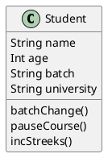

#### What is  LLD?

1. Low level implementation details of a software system.
2. Organization of code.

#### Why is LLD Important?

Phonepe uses yes bank for all its UPI payments and when RBI banned yes bank then it makes only one day to phonepe to be back online all because of good code design and their code are not tightly coupled.

#### Principles of good software

1. Code Reuse.
2. Why it is difficult to write code that is reusable?
    a. Tight Cpupling
        ```Java
            pay(user) {
                rozerpay(user)
            }

            pay(user) {
                payu(user)
            }
        ```
    b. Hardcoded Things
        ```Java
            throw exception() {
                print("Exception occured"); # not resuable
            }
        ```

        ```Java
            throw exception(message) {
                print(message);
            }
        ```

        ```Java
            const PI = 3.14
            findAreOfCircle(redius) {
                return PI * (redius) ^ 2;
            }

            findCircumferenceOfCircle(redius) {
                return PI *2*radius
            }
        ```
3. Extensibility
    a. new requirement
    b. new feature

    example today we support Rozerpay and PayU and tomorrow we want to support paytm. Then how easy is to extend to the new payment provider will be benchmark for extensibility.

    Reasons
        a. New Platform: IOs/Web/Android
        b. Change of user preferences
        c. Product roadmap changes.

Design Patterns/Principles: Tried and tested solution to common desing problem.
    a. this will help to communicate with follow engineers
    b. Identify problems and resolve early.

#### Introduction To OOPS:

1. Sequental/Procedural Programming language:
    ```c++
        int main() {
            int a = 10; // sequential: run line by line
            print(a); // Procedural: execute multiple procedure or function.
        }
    ```

Write a code to store and print the details of an animal.
    animal -> name, id, sound.

class: Blueprint of a real world entity
    ```Java
        class Student {
            name
            age
            batch
            experience
            university
        }

        class Instructors {
            name
            age
            experience
        }

        class Mentor {
            name
        }
    ```

Object: Objects are real instance of a class.

Fields + Methods = Member of a class

<div hidden>

</div>


State: The value of every field of a class at a particular time is known as the state of the class.

```puml
    class Human {
        name
        age
        gender
    }

    class Student { 
        coins
        batch
    }

    class Instructor {
        doj
        ratings
    }
```
