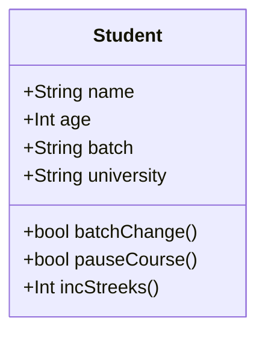
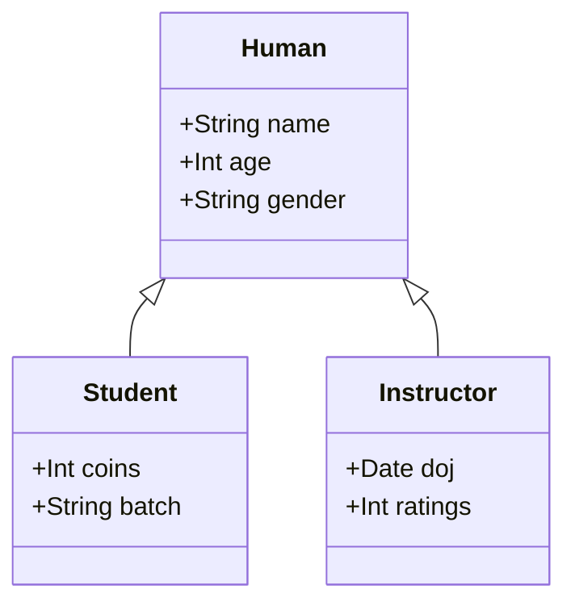
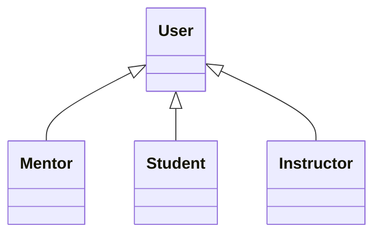
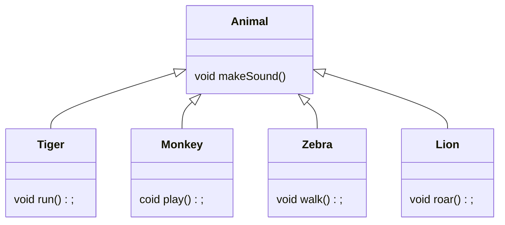
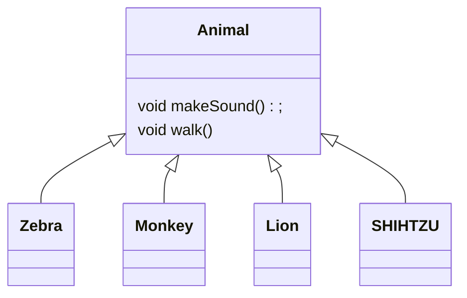
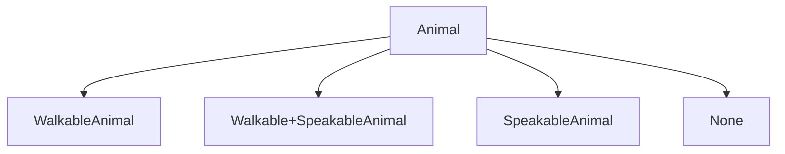
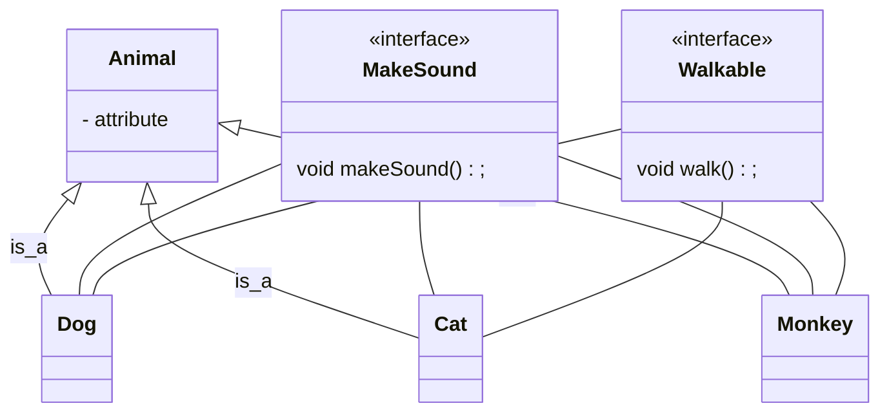
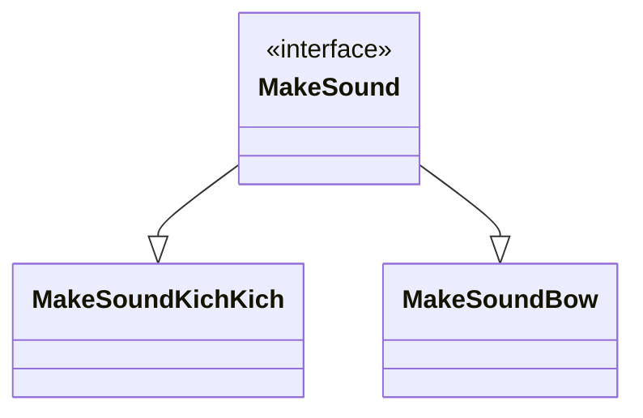
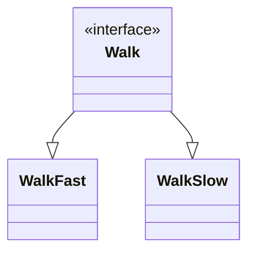
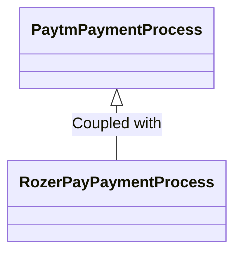

#### What is  LLD?

1. Low-level implementation details of a software system.
2. Organization of code.

#### Why is LLD Important?

Phonepe uses Yes Bank for all its UPI payments and when RBI banned Yes Bank, it took only one day for Phonepe to be back online because of good code design, and their code is not tightly coupled.

#### Principles of good software

1. Code Reuse.
2. Why is it difficult to write reusable code?
    a. Tight Coupling
        ```Java
            pay(user) {
                rozerpay(user)
            }

            pay(user) {
                payu(user)
            }
        ```
    b. Hardcoded Things
        ```Java
            throw exception() {
                print("Exception occurred"); # not reusable
            }
        ```

        ```Java
            throw exception(message) {
                print(message);
            }
        ```

        ```Java
            const PI = 3.14
            findAreOfCircle(radius) {
                return PI * (radius) ^ 2;
            }

            findCircumferenceOfCircle(radius) {
                return PI *2*radius
            }
        ```
3. Extensibility
    a. new requirement
    b. new feature

    For example today we support Rozerpay and PayU and tomorrow we want to support Paytm. Then how easy it is to extend to the new payment provider will be a benchmark for extensibility.

    Reasons
       a. New Platform: IOs/Web/Android
       b. Change of user preferences
       c. Product roadmap changes.

Design Patterns/Principles: Tried and tested solution to common desing problem.
    a. this will help to communicate with follow engineers
    b. Identify problems and resolve early.

#### Introduction To OOPS:

1. Sequental/Procedural Programming language:
    ```c++
        int main() {
            int a = 10; // sequential: run line by line
            print(a); // Procedural: execute multiple procedure or function.
        }
    ```

Write a code to store and print the details of an animal.
    animal -> name, id, sound.

class: Blueprint of a real world entity
    ```Java
        class Student {
            name
            age
            batch
            experience
            university
        }

        class Instructors {
            name
            age
            experience
        }

        class Mentor {
            name
        }
    ```

Object: Objects are real instance of a class.

Fields + Methods = Member of a class




State: The value of every field of a class at a particular time is known as the state of the class.


All the child class inherits the attributes and methods from their parent class.

```Java
    public class Human {
        String name;
        String dob;
        String gender;
    }

    public class Student extends Human {
        int id;
        int coin;

        Student() {
            this.name = "";
            dob = "24101998";
            id = 21;
        }

        void updateName(String newName) {
            this.name = newName;
        }
    }
```

Interface: Blueprint of a behaviour. (Contract/API)
It means that anyone who implemented my behaviour should implement the methods that i am telling to implement.

```Java
    interface Run {
        void run();
        void move();
    }

    public interface BatchChange {
        void changeBatch(String newBatch) {

        }
    }

    public class Student extends Human implements BatchChange {
        public void changeBatch(String newBatchName) {
            System.out.println("done");
        }
    }
```

Note: Do not favor inheritence over interfaces.
Note: Favor Interface over Inheritence.

Note: When we overwrite a method the previous method gets deleted.
Note: when we can assign an object of a child class to parent class then it is called polymorphism.

Only child class can be type casted to a parent class.
```Java
    Human b = new Instructor()

    // b can only access the property of human class
```

### OOP Principles and Solid Principles

Abstraction: Represent all details for an entity in a context and hiding the complexity of a system.
1. It will omit the non-needed details.
2. Abstraction is the benifit oops provide.
3. OOP's provide abstraction on 3 pillers
    a. Encapsulation
    b. Inheritance
    c. Polymorphism.
4. Exposing behaviours that client needs to use.

Encapsulation: Holding data & behaviour together and prevent external things from modifying the internal details.
    Access Modifier
        a. private: only accessible inside the class (not accessible inside child class).
        b. public: publically accessible
        c. protected: only accessible inside a package
        d. default:

*Golden Rule : If you anytime make an API public, you are forced to support it.

Inheritance: Way to organize different entity in my system.

    Has-a : It means composition
    is-a : It meand Inheritance



Benifits
1. Code Reuse
2. Extensibility

Extension mean adding new things not changing and adding new things.
Overriding is not extension.
Overriding is not the best use of inheritence. so use composition

Polymorphism (Many forms)



```Java
    Animal a = new Lion() // Use less memory
    a.makeSound()
    a.roar() // this will not work
```

No need to know the real data type.

```Javascript
    havePartyInJungle(List<Animal> animals) {
        for(Animal a: animals) {
            a.makeSound();
        }
    }
```

Polymorphism is when the client don't need to know the real data type.

We are in a jungle and there is a dob type SHIHTZU that does not make sound.



# implement makeSound & walk function in subclass.

```Java
    class SHIHTZU {
        makeSound() {
            throw exception("Not Supported");
        }
    }
```

Now imagine animal that can not walk as well as sound
let's imagine two dogs which makes the same sound

How will we support all this.



Now lets say we have 8 different behaviours then how many different subclass will be there to support.
    Number of class = $2^8$  # very bad design to implement.

Issues with Inheritence
    1. class overload
    2. code duplication.

we should only use Inheritence when we only talk about physical properties. And when we talk about behaviour we should not use inheritance. we should use interface.

If a behaviour is certain then that can be included in the base class of inheritance other wise create an interface for that behaviour.



It will solve the problem of class overload.





Loose Coupling: No 2 code systems should be directly connected to each other. No direct connection between any 2 classes.

Dog Has_A walking Behaviour : This is known as Composition.
Always Favour Composition over inheritance.


In java every class by default extends object class.

Design Principles: Basic rules suggestions/ideas to implemented good software.

Solid Design Principles
    S -> Single Responsibility Principle.
    D -> Open/close Principles.
    L - Liskows Substitution Principles.
    I -> Interface Segregation.
    D -> Dependency Inversion.

Single Responsibility Principles: No code unit (Method/Class/Package) should not have more than 1 responsibility.

```Java
    class Bird {
        String type;
        void fly() {
            // violating the single Responsibility principles.
            if(type == 'pigeon') {

            } else if (type == 'crow') {

            }
        }
    }
```
Why is following SRP is implemented:
    Testing will be difficult.
    Difficult to understand.
    Difficult to work in parallel with multiple developers.

Solution: Break your code into multiple classes/methods and packages.

Don't do too much of any design principle.

How to identify if SRP principle is having violated(litmus test of SRP)
    Multiple if-else
    Monster Method: Doing more than what it states to do.

```Java
    save() {
        // db query
        // changing class state
        // logging
        // saving
    }
```
    utility classes: often become a collection of junks 
    # some companies strictly banned utility classes.

Open/Close Principle: Whenever we need to add new feture, our already written codebase should not need any modification.
    our code base should be open for extention.
        -> Add new classes/methods.
    code should be closed for modification but open for extension.

Liskov's substitution Principles: Object of a parent class should be completly replacable by an object of a child class.

```mermaid
    flowChart TD
        B -> A: Extends
        C -> B: Extends
```

```Java
    A/B/C a = new A()/B()/C()
    a.doSomething() // It will not get affected
    a.doAnother()
```

We throw an exception from a child class

```Java
    interface PrintToConsole {
        print(c)
    }

    class Printer implements PrintToConsole {
        print()
    }

    // This is also a violation of LSP
    // when we give different meaning to the method of a parent class/Interface.
```

LSP: If you are overwriting any method, the method should be logically equivalent to the parent one.

Interface Segrigation
```Java
    interface Walkable {
        void walk()
        void MoveKnees(); // snake has no knees.
    }
```

Interface Segrigation: Interface should be as lite as possible.
    Don't have thick interfaces.
    Focus on a single job.
    This interface segrigation introduce Lambda/Functional Interface. -> Interface with single method.

Dependency Inverson
```Java
    class PaytmPaymentProcess {
        RozerPay/JustPay r = new RozerPayProcess()/JustPayProcess()

        pay() {
            r.generatePaymentLink()
            r.pay()/r.makePayment()
        }
    }
```



Moving to JustPay will be difficult because a dependency is changing.

Dependency Inversion: No 2 concrete classes should ever depend directly on each other.

Any 2 concreate classes should depend on each other via a layer of abstraction.


