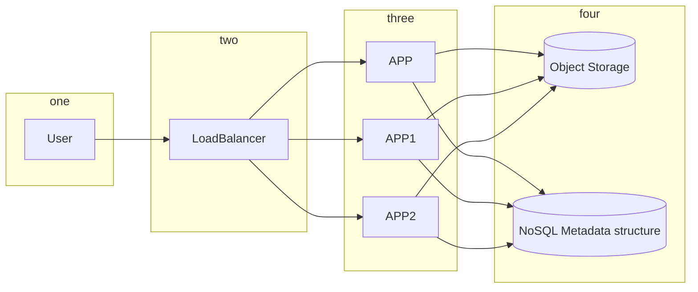

Functional Requirements
    1. upload
    2. watch videos

Non Functional Requirements
    1. Reliability
    2. Scale 1B DAU watching 5/day
    3. Availability > Consistency
    4. Minimise Latency

High Level Design

